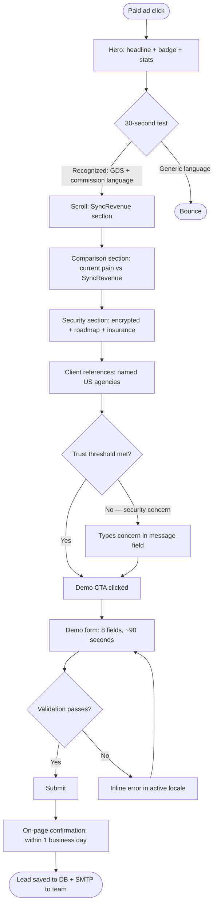
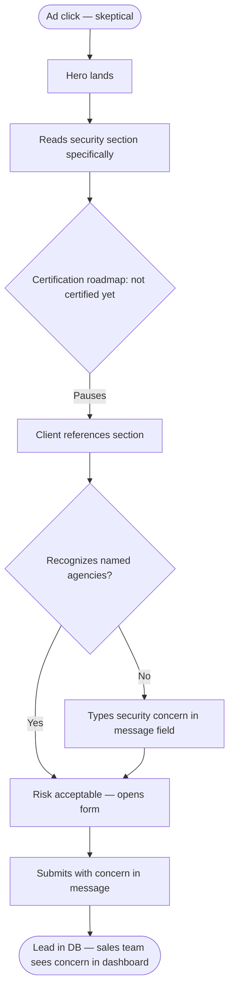
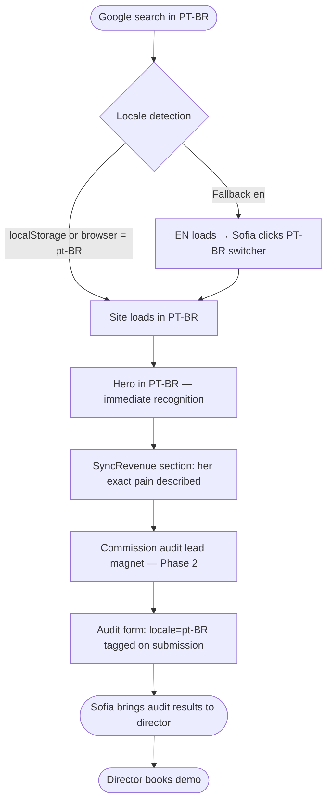
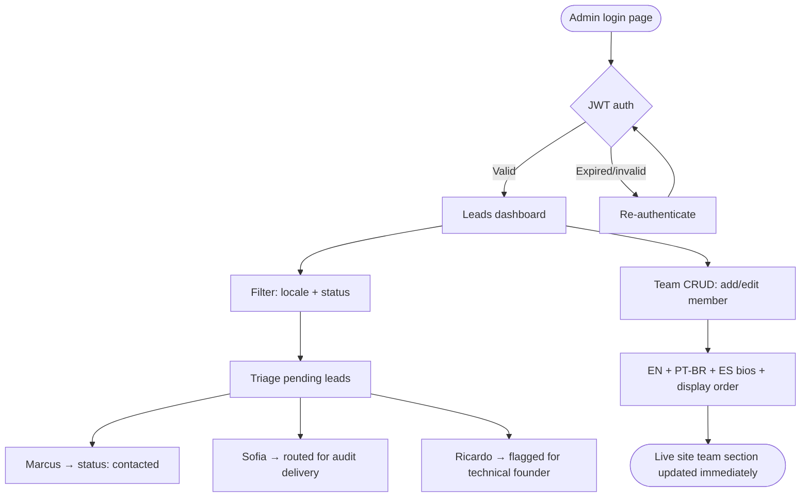

# UX Design Specification syncrevenue-website

**Author:** Pri
**Date:** 2026-05-13

---

## Executive Summary

### Project Vision

Sync Sirius institutional website — B2B SaaS marketing site whose primary goal is to generate qualified demo pipeline for SyncRevenue, a commission management platform that recovers 15–25% of lost agency commission revenue from GDS discrepancies, debit memos, and BSP reconciliation failures. Site is primary trust-building surface before any human sales touch. No pricing. Premium specialist positioning for the Americas travel agency market.

### Target Users

- **Marcus** (CFO/Owner, Miami) — P&L pain, 30-second attention span, skeptical of ROI promises, willing to convert when numbers and trust signals land. Primary conversion persona.
- **Ricardo** (Boutique agency owner, Toronto) — security-first mindset, actively researching before touching "Book Demo". GDS credentials are sacred. Trust-barrier persona.
- **Sofia** (Ticketing supervisor, São Paulo) — daily debit memo pain, PT-BR native, not the buyer but becomes internal champion when she sees her exact pain described. Phase 2 lead magnet persona.
- **Ana** (Sync Sirius ops, Miami) — internal user managing leads pipeline via admin dashboard. Phase 3 persona.

### Key Design Challenges

1. **Trust before action** — Security-skeptic buyers (Ricardo) must clear a trust barrier before form submission. Trust signals must appear *before* the CTA, not after.
2. **30-second first impression** — Paid ad traffic lands cold. Marcus gives 30 seconds. Hero + above-fold must communicate GDS-specific pain and ROI signal before scroll.
3. **Locale nativeness** — Three languages (EN/PT-BR/ES) must feel genuinely localized, not machine-translated. PT-BR landing for Sofia signals she's in the right place immediately.

### Design Opportunities

1. **Domain-signal copy** — Precise GDS/BSP/debit memo vocabulary as a trust differentiator. Generic SaaS sites don't speak this language. Experts do.
2. **Progressive trust architecture** — Deliberate scroll journey: pain recognition → product credibility → security reassurance → social proof → CTA. Each section primes the next.
3. **Conversion-optimized form UX** — Multi-field demo form with locale-aware validation. Opportunity to reduce friction and anxiety at the most critical conversion moment.

## Core User Experience

### Defining Experience

Demo form submission is the make-or-break interaction. Every section, every scroll, every trust signal exists to prepare one moment — a qualified buyer clicking submit. The entire site is a trust-building funnel culminating in that action.

### Platform Strategy

Web SPA (React/Vite). Desktop-primary — B2B CFO/owner audience operates at a desk. Mobile functional at Phase 1, polished at Phase 2. Mouse/keyboard primary input. No offline requirement. Touch-capable via responsive breakpoints (< 768px / 768–1024px / > 1024px).

### Effortless Interactions

- **Locale detection** — must just work on first load, zero user action. PT-BR loads for Sofia before she reads a word.
- **Scroll journey** — guided progression through trust sections. Each section answers the next mental objection without requiring the user to navigate.
- **Demo form** — 90-second completion target. Locale-aware Zod validation eliminates confusion, never punishes the user mid-form.

### Critical Success Moments

1. **3-second hero read** — Marcus reads headline + subheadline, recognizes "his world" (GDS, commissions, travel agencies). This is the first gate.
2. **Trust barrier cleared** — Ricardo reads security section + client references, decides risk is acceptable. This is the second gate.
3. **Form submitted + confirmed** — Conversion complete. Confirmation copy ("within 1 business day") lands with confidence, not bureaucracy.
4. **PT-BR first load** — Sofia's page loads in her language. That single signal tells her she's in the right place before reading a word.

### Experience Principles

1. **Trust before the ask** — No CTA without preceding trust signals. Security section and references must appear before Marcus reaches the demo form.
2. **Domain precision over generic SaaS** — GDS/BSP/debit memo vocabulary signals expertise. Visitors who know these words feel recognized. Visitors who don't self-select out correctly.
3. **Locale nativeness from zero** — Language detection is infrastructure, not a toggle. Switching locales must never cause layout shift or reset scroll position.
4. **Friction removal at the moment of commitment** — Form fields are expected, validation is helpful (not punishing), confirmation is confident. Nothing at the submit step should feel risky.

## Desired Emotional Response

### Primary Emotional Goals

- **Recognized** — Marcus and Ricardo must feel "this is built for people exactly like me." GDS/BSP/debit memo vocabulary triggers recognition before any explicit claim.
- **Reassured** — security-skeptic visitors must move from anxiety to confidence before touching the form. Reassurance is the product before the product.
- **Capable** — after submitting, visitor feels proactive and ahead, not like they're waiting on a vendor. "I'm already one step ahead of my competitors."

### Emotional Journey Mapping

| Moment | Target emotion | Avoid |
|---|---|---|
| First load (hero) | Recognition / relevance | Confusion, "wrong place" |
| Scrolling product section | Informed, intrigued | Overwhelmed, skeptical |
| Security section | Reassured, risk-reduced | Anxious, doubtful |
| Client references | Trust, social validation | Suspicion ("paid testimonials?") |
| Demo form | Confident, low-risk | Intimidated, exposed |
| Post-submission | Accomplished, ahead | Abandoned, uncertain |
| Error/validation | Helped, guided | Punished, stupid |

### Micro-Emotions

- **Confidence over confusion** — every form label, validation message, and CTA is unambiguous
- **Trust over skepticism** — trust signals feel earned (verifiable agencies, specific claims), not asserted (vague promises)
- **Calm over excitement** — B2B financial product. Calm authority beats hype. No "revolutionary" or "game-changing."
- **Accomplishment over relief** — form submission feels like a proactive decision, not a burden lifted

### Design Implications

- Recognition → precise domain copy at hero; not generic fintech language
- Reassurance → security section placed before demo CTA in scroll order; explicit data distinction (website collects vs. SyncRevenue processes)
- Confidence → form with clear labels, inline validation, no surprise required fields
- Accomplishment → confirmation copy written as positive outcome ("Our team will reach out within 1 business day"), not a receipt

### Emotional Design Principles

- Calm authority over hype — premium specialist positioning, not startup energy
- Earned trust over asserted trust — verifiable claims, named references, specific security commitments
- Helpfulness at friction points — validation guides, never punishes
- Locale as belonging signal — correct language on first load tells Sofia she's in the right place before she reads a word

## UX Pattern Analysis & Inspiration

### Inspiring Products Analysis

Target users (Marcus, Ricardo, Sofia) operate daily in Sabre (dense GDS terminal), Concur (enterprise travel/expense, institutionally trusted but complex), and Wooba Travellink (modern B2B OBT). They associate visual density and feature specificity with reliability. Lightweight or vague interfaces feel like startup toys to this audience.

**Sabre:** Power-user GDS terminal. Command-line adjacent. Users trust it because of specificity and power, not because it's pleasant. Lesson: this audience is NOT form-field-phobic. 8-field forms are normal. Simplifying aggressively signals the product lacks depth.

**Concur:** Institutionally trusted, notoriously complex. Users tolerate friction when credibility signals are strong enough. Lesson: trust comes from named workflows, institutional signals, and track record — not from clean UI alone. But clean UI that still signals credibility is the opportunity.

**Wooba Travellink:** Cleaner than Sabre, feature-list oriented. Lesson: feature listing without pain framing misses the emotional hook.

### Transferable UX Patterns

**Precision as credibility (Stripe/Sabre mirror principle):**
Stripe earns developer trust by showing API code — speaking the exact language developers think in. SyncRevenue earns travel agency trust by naming GDS systems, BSP reconciliation, debit memos, commission assertivity. Domain vocabulary = credibility signal. Imprecision = instant disqualifier for this audience.

**Density tolerance at the right moment:**
Sabre/Concur users fill complex forms without flinching. The 8-field demo form signals Sync Sirius is asking the right questions. Over-simplifying the form in a misguided attempt to reduce friction would backfire.

**Calm authority visual tone (Linear/enterprise SaaS):**
No emoji. No "revolutionary." No animated counters. Precise, confident prose. Navy + electric blue brand colors align with this tone. Premium specialist, not funded startup.

**Credibility through specificity (Concur pattern):**
Client references must be named US agencies, not "a leading travel management company." Vague references read as fabricated to this audience.

### Anti-Patterns to Avoid

- **Generic SaaS hero** — "The platform for modern teams." Marcus exits in 3 seconds. Hero must name GDS, commissions, travel agencies.
- **Startup energy aesthetics** — gradient everything, animated counters, "game-changing," emoji-heavy. Destroys premium specialist positioning instantly.
- **Pure feature listing without pain anchoring** — "Multi-GDS integration" means nothing without "the debit memo from last Monday that cost 4 hours to dispute."
- **Premature CTA before trust buildup** — CTA before trust section = premature ask. Trust must be built before the demo form appears in scroll order.

### Design Inspiration Strategy

| Action | Pattern | Reason |
|---|---|---|
| Adopt | Domain precision (Stripe/Sabre language mirror) | Core trust mechanism for this audience |
| Adopt | Calm authority tone (Linear visual aesthetic) | Matches brand positioning and emotional goals |
| Adapt | Sabre density tolerance → appropriate form length | 8 fields is expected; don't strip fields chasing false simplicity |
| Adapt | Concur institutional signals → without enterprise bloat | Named references, specific claims, clear data handling — not compliance walls |
| Avoid | Generic SaaS hero copy | Vague = wrong audience signal = bounce |
| Avoid | Startup energy aesthetics | Undermines premium specialist positioning |
| Avoid | Feature lists without pain anchoring | Misses Marcus's "so what" moment |

## Design System Foundation

### Design System Choice

**Tailwind CSS v3 + shadcn/ui** — Themeable system (Option 3). Components are owned code (not installed as a dependency), fully customizable, accessibility-aware by default.

### Rationale for Selection

- shadcn/ui components are WCAG 2.1 AA-aligned out of the box; maintain ARIA patterns when customizing
- Tailwind utility classes map directly to brand color tokens without a separate CSS layer
- Small team (1–2 devs) — avoids rebuild-from-scratch cost while keeping full design control
- Brand blue (`#0075F0` on white) requires WCAG AA contrast validation — shadcn default patterns make this auditable without extra tooling

### Implementation Approach

- Brand colors defined as Tailwind CSS custom tokens (CSS variables in `tailwind.config.ts`)
- shadcn components extended, never replaced — keep accessibility baseline, apply brand skin on top
- Font: candidates Syne, DM Sans, Outfit, Plus Jakarta Sans (Inter/Roboto explicitly rejected). Decision at implementation.

### Customization Strategy

- **Gradient rule:** never flat solid blue on prominent brand elements — always `linear-gradient(135deg, #0055F0, #0075F0, #00A0F0)`
- **Logo rule:** full color on dark navy only, or full color + navy wordmark on white/offwhite; never mid-tone backgrounds
- **Color tokens:** Electric Blue `#0075F0` (primary CTA/links), Navy `#0D0D3A` (navbar/footer/dark sections), Slate `#404070` (cards/borders), Muted `#8080A0` (placeholders/labels)
- **Dark sections:** `linear-gradient(180deg, #0D0D3A 0%, #080820 100%)`

## Component Strategy

### Design System Components

shadcn/ui components available and mapped to journeys:

| Component | Used for |
|---|---|
| `Button` | All CTAs (themed with gradient variants) |
| `Form` + `Input` + `Textarea` | Demo request form, contact form |
| `Select` | GDS system dropdown, role, subject dropdowns |
| `Toast` | API error notification |
| `Dialog` | Demo form modal (if modal pattern chosen) |
| `Badge` | Hero badge, GDS tags, lead status in admin |
| `Card` | Service cards, team member cards, trust cards |
| `Table` | Leads dashboard, admin views |
| `Skeleton` | Loading states throughout |
| `Separator` | Section dividers |
| `DropdownMenu` | Language switcher, admin nav |

### Custom Components

**`GradientButton`**
- Purpose: primary CTA with brand gradient fill — shadcn Button doesn't support gradient bg natively
- States: default, hover (brighten), active (scale 0.98), disabled (opacity 50%)
- Variants: `lg` (hero/section CTA), `md` (form submit), `sm` (navbar)
- Accessibility: explicit `type="button"`, focus-visible ring in white on dark bg

**`LanguageSwitcher`**
- Purpose: locale toggle (EN / PT-BR / ES) in navbar and footer
- States: active locale (highlighted), inactive (muted), hover
- Behavior: updates `useLocaleStore` → i18next `changeLanguage()` → localStorage persist → no page reload, no layout shift
- Accessibility: `aria-label="Select language"`, active locale `aria-current="true"`

**`TrustBar`**
- Purpose: full-width strip below hero with 4 trust signal chips
- Content: Encrypted transmission · Certification roadmap · Contract insurance · Referenced US agencies
- Mobile: horizontal scroll or 2×2 grid at < 768px

**`StatRow`**
- Purpose: 3-column stat display in hero (99.99%, 15–25%, Multi-GDS)
- Numbers use gradient text treatment
- Mobile: stacks to 3-row vertical

**`DemoForm`**
- Purpose: 8-field lead capture with locale-aware Zod validation
- States: idle → loading (submit) → success (confirmation replaces form) → error (Toast)
- Confirmation: "Request received! Our team will reach out within 1 business day."
- Accessibility: all fields `htmlFor`/`id` linked, `aria-describedby` on errors, `aria-live="polite"` on confirmation

**`SectionHeader`**
- Purpose: reusable eyebrow + h2 + optional subtext block
- Variants: light bg (dark text), dark bg (white text)

**`ComparisonTable`**
- Purpose: feature rows vs. legacy/generic tools — no competitor names
- Mobile: horizontal scroll

**`AdminLeadRow`** (Phase 3)
- Purpose: lead row with inline status update
- States: pending / contacted / qualified (badge color-coded)

### Component Implementation Strategy

- All custom components built on Tailwind tokens — no hardcoded hex values in component files
- shadcn components extended via `className` prop + Tailwind overrides, never forked
- Gradient applied via CSS class `bg-gradient-brand` defined in `tailwind.config.ts`
- ARIA patterns from shadcn preserved on all customized components

### Implementation Roadmap

**Phase 1 — MVP:**
`GradientButton`, `LanguageSwitcher`, `TrustBar`, `StatRow`, `DemoForm`, `SectionHeader`, `ComparisonTable`

**Phase 2 — Polish:**
Animation wrappers (Framer Motion), `SkeletonSection` for lazy content, mobile scroll polish

**Phase 3 — Admin:**
`AdminLeadRow`, admin Table extensions

## UX Consistency Patterns

### Button Hierarchy

| Tier | Component | Usage | Visual |
|---|---|---|---|
| Primary | `GradientButton lg/md` | Demo CTA, form submit | Brand gradient bg, white text |
| Secondary | `Button` ghost/outline | "Learn how it works", cancel | Border only, transparent bg |
| Tertiary | Text link | In-copy navigation, "see more" | Blue text, underline on hover |
| Disabled | Any | Until form valid | 50% opacity, no gradient, cursor-not-allowed |

Rule: never two primary buttons side-by-side. Hero has one primary + one tertiary.

### Feedback Patterns

- **Success (form):** On-page confirmation replaces form — `aria-live="polite"`. Not Toast.
- **Error (API failure):** shadcn `Toast` — bottom-right, auto-dismiss 5s, destructive variant. Never blocks page.
- **Validation error (field):** Inline below field on blur — red text `text-destructive`, `aria-describedby` linked. Never modal.
- **Loading (form submit):** Submit button shows spinner + "Sending…" text, disabled. No full-page overlay.
- **Info:** Not needed at Phase 1.

### Form Patterns

- Labels always above fields — never placeholder-as-label
- Required fields marked with asterisk in label; optional fields labelled "(optional)"
- Validation: on blur per field — not on keystroke, not on submit-only
- Error message: one sentence, specific ("Enter a valid work email" not "Invalid input")
- Submit: single button, full-width on mobile, right-aligned on desktop
- Post-submit: form replaced by confirmation — no success state on same form

### Navigation Patterns

- Navbar: sticky top, active section highlighted via scroll spy
- In-page anchors: smooth scroll to section ID — no route changes on single-page sections
- Language switcher: dropdown from navbar, selected locale persisted, no page reload
- Mobile hamburger: → full-screen overlay menu, close on outside click or Escape
- Footer: repeat nav links + Privacy Policy + locale switcher — not sticky

### Modal and Overlay Patterns

- Demo form: **section-embedded** (default) — preserves trust signals visible during form fill. Modal is Phase 2 option.
- Admin confirmations (Phase 3): shadcn `Dialog` with explicit cancel + confirm for destructive status changes.

### Empty and Loading States

- Leads dashboard empty: "No leads yet. Demo requests will appear here." — plain text, no illustration.
- Leads filtered to zero: "No leads match this filter." + clear filter button.
- Page sections loading: shadcn `Skeleton` matching section layout shape — not spinners.
- Form submit: button state only (spinner + "Sending…") — no page skeleton.
- Admin table loading: 3 row skeletons while fetching.

### Mobile Considerations

- Touch targets: minimum 44×44px on all interactive elements
- `TrustBar`: horizontal scroll < 480px; 2×2 grid 480–768px
- `StatRow`: vertical stack < 640px
- Form fields: full-width always on mobile; no side-by-side fields below 640px
- Navbar: hamburger at < 768px

## Design Direction Decision

### Design Directions Explored

Six directions generated and reviewed via interactive HTML showcase (`ux-design-directions.html`):

1. Dark-First Immersive — full navy, gradient CTAs, trust bar in hero
2. Light Corporate Authority — white-dominant, demo form in hero panel
3. Bold Gradient Immersive — high energy, glow effects, pain-first headline
4. Editorial Minimalist — heavy typography, restrained color, structural borders
5. Split-Screen SaaS — dark left / light right, full form on load
6. Dark Minimal / Linear-Inspired — grid texture, ultra-restrained, calm authority

### Chosen Direction

**Direction 1: Dark-First Immersive**

Full navy background (`#0D0D3A → #080820`), gradient CTAs, trust signal bar in hero, stats row below headline. Strongest visual brand presence of all directions.

### Design Rationale

- Premium specialist positioning requires visual authority — full dark navy immediately signals serious B2B product, not consumer SaaS
- Brand gradient (`#0055F0 → #0075F0 → #00A0F0`) is maximally legible and impactful on dark background
- Trust bar in hero ("Encrypted transmission · Certification roadmap · Contract insurance · Referenced US agencies") surfaces Ricardo's primary concerns without requiring him to scroll
- Stats row (99.99% assertivity, 15–25% leakage, Multi-GDS) gives Marcus the ROI signal before first scroll
- Navy section rhythm allows white/offwhite alternating sections below without visual confusion — dark hero anchors the experience

### Implementation Approach

- Navbar: sticky, dark navy, full width. Logo left. Nav links center. Language switcher + Demo CTA right.
- Hero: dark gradient bg, radial glow top-right, content max-width 640px left-aligned
- Badge: small pill with location + Americas positioning signal
- H1: 52px, 800 weight, gradient text on key phrase
- Trust bar: full-width strip below hero, semi-transparent dark bg, checkmark items inline
- Below hero: alternating white/offwhite sections for SyncRevenue, Services, Comparison, Team
- Demo section: returns to dark navy — visual bookend

## 2. Core User Experience

### 2.1 Defining Experience

> "Request a demo and feel confident it was the right call."

Established UX pattern (contact form) executed with precision. The innovation is in what surrounds the form — the scroll journey that builds enough trust for a security-skeptic buyer to submit GDS credentials context to an unknown vendor.

### 2.2 User Mental Model

Marcus and Ricardo arrive with Concur/Sabre mental models — enterprise software asks many questions before delivering value. They are not surprised by multi-field forms. What they don't expect: a marketing site that speaks their exact language, acknowledges their exact fear (GDS credential security), and gives verifiable proof before asking anything.

Current workaround: ignore cold outreach, attend trade shows, ask colleagues. This site intercepts that pattern via paid ad → site → demo, and must justify the shortcut through domain precision and trust signals.

### 2.3 Success Criteria

- Form completed in ≤ 90 seconds with no field confusion
- Zero surprise required fields — all fields visible upfront
- Locale-aware validation — error messages in visitor's active language
- Confirmation delivered immediately on-page (no redirect, no blank state)
- Visitor feels informed, not processed — confirmation names the next human step

### 2.4 Novel UX Patterns

No novel patterns required. Demo request form is a universal B2B established pattern requiring no user education. Innovation is entirely contextual:
- Scroll order: trust signals before CTA, not CTA before trust
- Copy specificity: GDS vocabulary, not generic SaaS language
- Field choice: GDS system field signals domain expertise; role field enables sales prioritization
- Confirmation tone: confident next-step language, not automated receipt

### 2.5 Experience Mechanics

| Stage | Detail |
|---|---|
| **Initiation** | CTA in hero ("Schedule a Demo"), navbar, and repeated after security section. Scroll position determines which Marcus clicks. |
| **Interaction** | 8 fields: name, email, company, phone, role, GDS system (dropdown: Amadeus/Sabre/Galileo/Worldspan/Other/None yet), message (optional), locale (auto-filled, hidden). |
| **Feedback** | Inline Zod validation on blur — field-level, not form-level. Errors in active locale language. Submit disabled until required fields valid. |
| **Completion** | On success: on-page confirmation replaces form. "Request received! Our team will reach out within 1 business day." No redirect. SMTP fires server-side. Lead saved to DB regardless of email outcome. |
| **Error state** | API failure → shadcn Toast notification. Lead save failure → user-facing error with retry. Never silent failure. |

## User Journey Flows

### Journey 1: Marcus — CFO, Paid Ad → Demo Booked

Primary conversion journey. Entry via paid ad, 30-second trust test, scroll through trust sections, demo form submission.

### Journey 2: Ricardo — Security-Skeptic Owner → Trust → Demo

Trust-barrier journey. Security section is the critical gate. Message field is the escape valve.

### Journey 3: Sofia — PT-BR Supervisor → Internal Champion

PT-BR locale journey. Language detection is the first trust signal. Lead magnet converts her to internal champion (Phase 2).

### Journey 4: Ana — Ops Team, Admin Lead Management

Internal admin journey. JWT auth, lead triage, team CRUD (Phase 3).

### Journey Patterns

- **Scroll-as-trust-build** — section order is fixed: Hero → SyncRevenue → Comparison → Security → References → Demo CTA. Non-negotiable scroll sequence.
- **Locale propagation** — detected once, persisted in localStorage, applied to all copy + validation + form submission tag. Never re-asked.
- **Message field as escape valve** — security concern doesn't block conversion; routes to message field. Sales team sees it in admin dashboard.
- **Confirmation as closure** — on-page replacement (not redirect). Lead saved to DB before SMTP fires. SMTP failure invisible to visitor.

### Flow Optimization Principles

- Demo CTA appears 3× (hero, navbar, after security section) — all route to same form regardless of scroll position
- Form hidden locale field pre-filled automatically — zero user friction on market segmentation
- Submit disabled until required fields valid — prevents empty submission error states
- All inline validation on blur, not on submit — error surfaces at field level, not as a wall on submit

## Visual Design Foundation

### Color System

Brand colors fully specified. Locked.

| Token | Hex | Role |
|---|---|---|
| Electric Blue | `#0075F0` | Primary CTA, links, icons |
| Highlight | `#00A0F0` | Hover states, gradient top |
| Deep | `#0055F0` | Gradient bottom, active states |
| Navy | `#0D0D3A` | Navbar, footer, dark section bg |
| Slate | `#404070` | Cards, borders, dividers |
| Muted | `#8080A0` | Placeholder text, labels |
| White | `#FFFFFF` | Light section bg |
| Offwhite | `#F4F6FA` | Alternate light section bg |

- **Brand gradient:** `linear-gradient(135deg, #0055F0 0%, #0075F0 50%, #00A0F0 100%)` — CTAs, icons, prominent dividers
- **Dark section gradient:** `linear-gradient(180deg, #0D0D3A 0%, #080820 100%)`
- **Rule:** Never flat solid blue on prominent elements — always use gradient

### Typography System

- **Excluded:** Inter, Roboto
- **Candidates:** Syne, DM Sans, Outfit, Plus Jakarta Sans
- **Recommended:** Plus Jakarta Sans — geometric, modern, confident; strong Latin/extended character support for PT-BR and ES
- **Tone:** calm authority, professional, modern — not humanist/friendly
- **Content type:** headings-dominant (marketing site) + medium paragraphs (security section, bios) + form labels
- **Decision:** deferred to implementation — font selection is an open item

### Spacing & Layout Foundation

- **Base unit:** 8px (Tailwind default scale; 4px increments available for fine-tuning)
- **Layout feel:** structured and spacious — premium specialist, not dense dashboard
- **Section rhythm:** alternating dark navy ↔ white/offwhite backgrounds create visual separation without decorative dividers
- **Max content width:** ~1280px centered, with generous section-level padding
- **Grid:** 12-column desktop, simplified tablet/mobile
- **Navbar:** sticky, full-width, dark navy bg, logo left, language switcher + Demo CTA right

### Accessibility Considerations

- `#0075F0` on white must pass WCAG AA (4.5:1 normal text, 3:1 large text) — open validation item
- Large text / CTA buttons (≥ 18px bold or ≥ 24px normal) require ≥ 3:1 — likely passes
- Body links on white at normal size require ≥ 4.5:1 — needs audit at implementation
- shadcn/ui ARIA patterns preserved on all customized components
- All form fields have programmatically associated labels and inline error messages
- Focus indicators visible on all focusable elements (Tailwind `focus-visible` utilities)

## Responsive Design & Accessibility

### Responsive Strategy

Desktop-primary (B2B CFO/owner at desk). Mobile functional Phase 1, polished Phase 2. No tablet-specific layouts — tablet uses compressed desktop grid.

**Desktop (> 1024px):**
- Max content width 1280px centered
- Full navbar with all links visible
- Multi-column layouts: 3-col trust cards, 4-col feature row
- Hover states throughout
- `StatRow` horizontal, `TrustBar` single row

**Tablet (768–1024px):**
- Desktop grid compressed — most sections remain multi-column
- Navbar collapses to hamburger at 768px
- `TrustBar` → 2×2 grid
- Demo form full-width

**Mobile (< 768px):**
- Single-column throughout
- Hamburger nav → full-screen overlay
- `StatRow` vertical stack
- `TrustBar` horizontal scroll or 2×2
- All form fields full-width, no side-by-side
- Headings scale: 52px desktop → 32–36px mobile

### Breakpoint Strategy

| Name | Range | Tailwind prefix |
|---|---|---|
| Mobile | < 768px | (default) |
| Tablet | 768–1024px | `md:` |
| Desktop | > 1024px | `lg:` |
| Wide | > 1280px | `xl:` (max-width clamp) |

Mobile-first CSS — base styles for mobile, `md:` and `lg:` overrides upward.

### Accessibility Strategy

Target: WCAG 2.1 AA across all public-facing pages. Non-negotiable per PRD.

- **Color contrast:** `#0075F0` on white must be validated at implementation. Normal text ≥ 4.5:1, large text/CTA ≥ 3:1. Brand blue on navy passes easily.
- **Keyboard navigation:** all interactive elements operable via keyboard alone. Tab order follows visual reading order.
- **Focus indicators:** `focus-visible:ring-2 focus-visible:ring-white` on dark sections; `focus-visible:ring-blue-600` on light sections.
- **Screen readers:** semantic HTML (`<nav>`, `<main>`, `<section>`, `<footer>`), all images with `alt`, all form fields with associated `<label>`.
- **ARIA:** `aria-label` on icon-only buttons, `aria-live="polite"` on form confirmation, `aria-describedby` on field errors, `aria-current="true"` on active locale.
- **Skip link:** "Skip to main content" as first focusable element, hidden until focused.
- **Locale switching:** must not break focus or cause layout shift. `changeLanguage()` re-renders in place.
- **Reduced motion:** locale switch and Phase 2 animations respect `prefers-reduced-motion`.

### Testing Strategy

| Test type | Tool / Method |
|---|---|
| Contrast ratio | Browser DevTools + axe |
| Keyboard navigation | Manual tab-through all pages |
| Screen reader | VoiceOver (macOS/iOS), NVDA (Windows) |
| Responsive | Chrome DevTools + real device |
| Browser support | Chrome, Firefox, Safari, Edge — latest 2 versions |
| Accessibility automated | axe-core or Lighthouse CI in build pipeline |

### Implementation Guidelines

- Mobile-first CSS — base styles mobile, `md:` / `lg:` overrides upward
- `rem` for font sizes, `%` / `vw` for layout widths — no fixed `px` for text
- Images: `width`/`height` attrs set to prevent CLS; lazy-load below fold
- `font-display: swap` to prevent invisible text during load
- i18n locale switch: no full re-render, no scroll position reset
